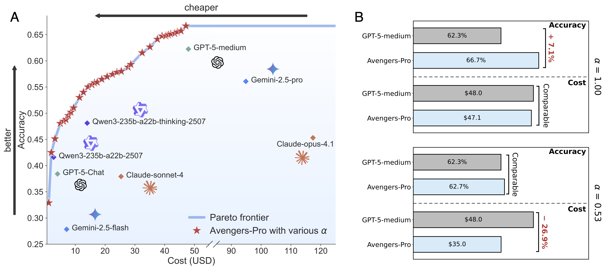
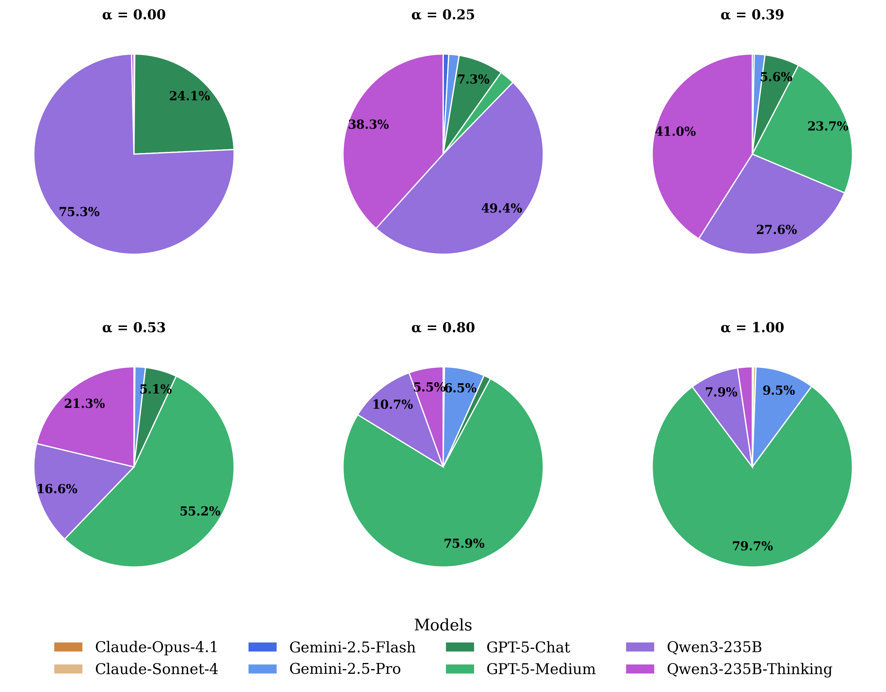

# Beyond GPT-5: Making LLMs Cheaper and Better via Performance–Efficiency Optimized Routing

<div align="center">



**A test-time routing framework that ensembles LLMs of varying capacities and efficiencies**

[](https://arxiv.org/abs/2508.12631)
[](https://www.python.org/downloads/)
[](https://opensource.org/licenses/MIT)

📄 **Paper**: [ArXiv](https://arxiv.org/abs/2508.12631)  
<!-- 📧 **Contact**: [author1@email.com](mailto:author1@email.com), [author2@email.com](mailto:author2@email.com) -->

</div>

---

## Abstract

Balancing performance and efficiency is a central challenge in large language model (LLM) advancement. GPT-5 addresses this with test-time routing, dynamically assigning queries to either an efficient or a high-capacity model. In this work, we present **Avengers-Pro**, a test-time routing framework that ensembles LLMs of varying capacities and efficiencies.

The **Avengers-Pro** embeds and clusters incoming queries, then routes each to the most suitable model based on a performance-efficiency score. Across 6 challenging benchmarks and 8 leading models—including GPT-5-medium, Gemini-2.5-pro, and Claude-opus-4.1—the **Avengers-Pro** achieves state-of-the-art results:

- 🏆 **+7% accuracy** improvement over the strongest single model (GPT-5-medium)
- 💰 **−27% cost reduction** while maintaining equivalent accuracy  
- ⚡ **−63% cost reduction** while achieving ~90% of peak performance
- 🎯 **Pareto-optimal** performance across all accuracy-cost trade-offs

## 📊 Experimental Results

### Benchmark Results

The performance and efficiency of *Avengers-Pro* vs. single models. **Bold** indicates the best performance of a given benchmark. Note that GPT-5-chat has no score on the τ²-bench benchmark because this model does not support tool calling.

| **Setting** | **ARC-AGI** | **GPQA-Diamond** | **HLE** | **LiveCodeBench** | **SimpleQA** | **τ²-bench** | **Avg. A** | **Cost** |
|-------------|-------------|------------------|---------|-------------------|--------------|--------------|------------|----------|
| **Gemini-2.5-flash** | 9.62 | 21.72 | 7.20 | 62.84 | 28.99 | 36.67 | 27.84 | $7.10 |
| **Gemini-2.5-pro** | 33.08 | 84.85 | 23.09 | 78.67 | 54.80 | 62.00 | 56.08 | $94.87 |
| **Claude-4.1-opus** | 22.12 | 74.24 | 6.41 | 64.07 | 31.00 | 74.00 | 45.31 | $117.40 |
| **Claude-4-sonnet** | 16.15 | 68.69 | 4.60 | 59.05 | 15.00 | 64.00 | 37.92 | $25.35 |
| **Qwen3** | 9.22 | 58.59 | 9.22 | 66.26 | 53.00 | 53.33 | 41.60 | $2.73 |
| **Qwen3-thinking** | 19.23 | 80.81 | 12.68 | 77.99 | 44.60 | 53.33 | 48.11 | $13.99 |
| **GPT-5-chat** | 6.73 | 73.73 | 7.80 | 63.60 | 40.20 | - | 38.41 | $4.04 |
| **GPT-5-medium** | 44.42 | 84.85 | 26.20 | 88.44 | 47.60 | **82.00** | 62.25 | $47.96 |
| | | | | | | | | |
| ***Avengers-Pro* (α=0)** | 15.33 | 58.67 | 10.13 | 66.94 | 46.27 | 0.00 | 32.89 | $1.08 |
| ***Avengers-Pro* (α=0.25)¹** | 29.33 | 67.00 | 10.00 | 76.53 | 53.60 | 72.89 | 51.56 | $9.69 |
| ***Avengers-Pro* (α=0.39)²** | 29.33 | 78.67 | 12.67 | 84.79 | 55.07 | 76.89 | 56.24 | $17.81 |
| ***Avengers-Pro* (α=0.53)³** | 51.67 | 80.00 | 25.46 | 87.45 | 54.93 | 76.44 | 62.66 | $35.05 |
| ***Avengers-Pro* (α=0.8)** | **59.67** | 81.00 | 27.60 | 89.34 | **56.93** | 78.22 | 65.46 | $44.65 |
| ***Avengers-Pro* (α=1)** | **59.67** | **85.67** | **28.67** | **89.59** | 56.40 | 80.00 | **66.66** | $47.13 |

**Key Findings:**
- ¹ *α=0.25*: With **7%** performance gain over GPT-5-medium
- ² *α=0.39*: Reaches 90% of GPT-5-medium's performance at **63%** lower cost
- ³ *α=0.53*: Matches GPT-5-medium's average accuracy while cutting cost by **27%**

### Performance-Cost Trade-offs


*We gradually increase the trade-off parameter α, placing more weight on performance over efficiency. As α increases, the average accuracy increases rapidly for small α and then plateaus near α≈0.6. On the other hand, as α increases, cost remains low until about α≈0.4 before rising sharply. These trends reveal two elbows (around 0.4 and 0.6) that offer favorable trade-offs.*

### Model Selection Distribution


*When α is low, Avengers-Pro tends to favor the Qwen3 and Qwen3-thinking models, routing a great proportion of queries to these two models with low unit prices. As α increases, the usage of GPT-5-medium rises rapidly; concurrently, the usage of Gemini-2.5-pro and Claude-opus-4.1, which excel at complex reasoning but have higher unit prices, also increases.*

## 🚀 Key Features

- **Intelligent Query Routing**: Semantic similarity-based model selection
- **K-means Clustering**: Groups similar queries to learn optimal routing patterns
- **Performance-Cost Balance**: Configurable trade-offs between accuracy and efficiency
- **Multi-Model Ensemble**: Compatible with 8+ state-of-the-art LLMs
- **Pareto Optimality**: Best accuracy-cost trade-offs across all scenarios

## 📦 Installation

### Requirements
- Python 3.10+
- Required dependencies (install via pip)

### Setup
```bash
# Clone repository
git clone <repository-url>
cd cluster

# Install dependencies
pip install -r requirements.txt

# Set environment variables
export EMBEDDING_API_KEY="your-embedding-api-key"
export EMBEDDING_BASE_URL="http://your-embedding-service:port/v1"
```

## 🚀 Quick Start

### Basic Usage
```bash
# Run simple cluster routing
python simple_cluster_router.py --input data/dataset.json --output results.json

# Run balance-aware routing with cost optimization
python balance_cluster_router.py --input data/dataset.json --output results.json \
  --performance_weight 0.7 --cost_sensitivity 0.3
```

### Data Format
Input file should be in JSONL format:
```json
{
  "query": "Your query text...",
  "records": {
    "anthropic/claude-opus-4.1": 0.95,
    "google/gemini-2.5-pro": 0.87,
    "openai/gpt-5-chat": 0.92
  },
  "usages": {
    "anthropic/claude-opus-4.1": {"cost": 0.045},
    "google/gemini-2.5-pro": {"cost": 0.023},
    "openai/gpt-5-chat": {"cost": 0.038}
  },
  "dataset": "arc-agi-v1",
  "index": 0
}
```

## 🏗️ Model Architecture

### Core Algorithm
1. **Training Phase**: 
   - Load query-performance data
   - Generate semantic embeddings 
   - Perform K-means clustering
   - Learn model rankings per cluster

2. **Routing Phase**:
   - Embed incoming query
   - Find nearest clusters
   - Aggregate performance scores
   - Select optimal model(s)

### Key Parameters

| Parameter | Default | Description |
|-----------|---------|-------------|
| `n_clusters` | 25 | Number of K-means clusters |
| `train_ratio` | 0.7 | Training data split ratio |
| `k` | 3 | Number of nearest clusters to consider |
| `performance_weight` | 0.7 | Weight for accuracy in balance mode |
| `cost_sensitivity` | 0.3 | Weight for cost efficiency in balance mode |

## 🔧 Advanced Configuration

### Balance-Aware Routing
```bash
python balance_cluster_router.py \
  --input data/dataset.json \
  --clusters 64 \
  --performance_weight 0.8 \
  --cost_sensitivity 0.2 \
  --export_cluster models/
```

### Model Exclusion
```bash
python simple_cluster_router.py \
  --input data/dataset.json \
  --excluded_models "model1,model2" \
  --excluded_datasets "dataset1,dataset2"
```

### Batch Processing
```bash
# Export trained models for inference
python simple_cluster_router.py \
  --input data/training.json \
  --export_cluster models/ \
  --clusters 32
```

## 📝 License

This project is licensed under the MIT License - see the [LICENSE](LICENSE) file for details.

## Star History

[](https://www.star-history.com/#ZhangYiqun018/AvengersPro&Date)

---

**Project Lead:** hushuyue@pjlab.org.cn, zhangyiqun344@gmail.com

<div align="center">
<i>For detailed technical implementation and comprehensive experimental results, please refer to our paper.</i>
</div>

```cite
@article{zhang2025beyond,
  title={Beyond GPT-5: Making LLMs Cheaper and Better via Performance-Efficiency Optimized Routing},
  author={Zhang, Yiqun and Li, Hao and Chen, Jianhao and Zhang, Hangfan and Ye, Peng and Bai, Lei and Hu, Shuyue},
  journal={arXiv preprint arXiv:2508.12631},
  year={2025}
}
```
