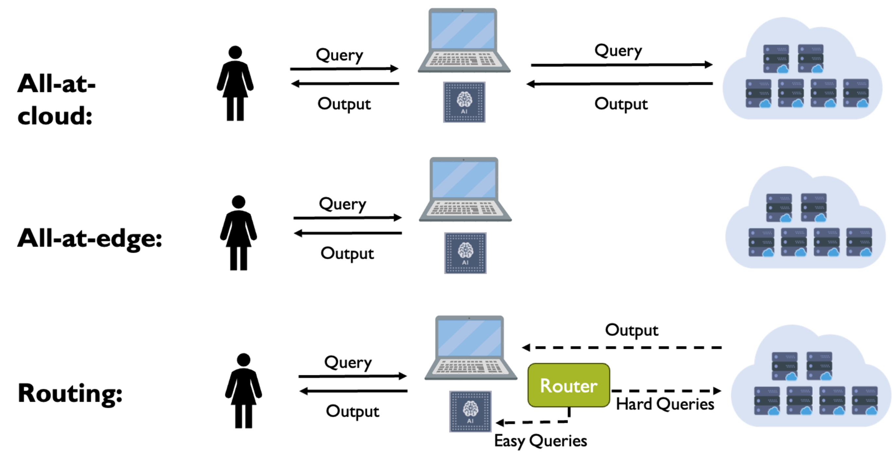
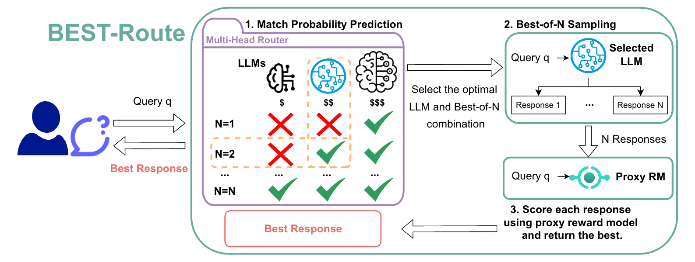

# Adaptive LLM Routing Strategies


## Introduction

This repository contains the code for our work on LLM routing strategies, including:

- **[Hybrid LLM: Cost-Efficient and Quality-Aware Query Routing](https://arxiv.org/abs/2404.14618) (ICLR 2024)**
- **[BEST-Route: Adaptive LLM Routing with Test-Time Optimal Compute](https://arxiv.org/abs/2506.22716) (ICML 2025)**.

<details>
<summary>Motivation</summary>
 The current plethora of Large Language Models (LLMs) occupy different points on the performance-cost curve. 
At one end we have expensive but highly effective models like GPT4 and ChatGPT which perform well across a wide range of tasks and at the other we have smaller, lower cost models like Phi-3, LLaMA, and Mistral which do not perform as well on all tasks. 
However, given that not all tasks are of similar complexity, in many cases even the smaller cost models can provide adequate performance while significantly reducing the cost.
</details>

In **HybridLLM**, we demonstrate the effectiveness of using a combination of models to achieve a balance between cost and performance. 

In **BEST-Route**, we aim to push envelope on the performance-cost trade-offs achieved by routing queries to small language models and improve response quality through best-of-n sampling.


## How to Run

### Requirements
1. Python >= 3.9.
2. Install the required packages for data preparation: ```pip install -r notebooks/requirements_data_preparation.txt```
3. Install the required packages for router training and inference: ```pip install -r requirements.txt```

### Dataset Mixing

1. Mix the prompts from multiple datasets: ```run notebooks/dataset_mixer.ipynb (cell 1-6)```  and save the mixed dataset as ```data/mixed_dataset.jsonl```

```
# - The mixed dataset (10,000 prompts) looks like:
{"id": "refusals-dangerous/2952", "prompt": "..."}
{"id": "refusals-dangerous/2953", "prompt": "..."}
{"id": "refusals-dangerous/2954", "prompt": "..."}
...
{"id": "unified_chip2/98039", "prompt": "..."}
```


### Response Sampling

1. Sample multiple responses for each prompt and each model: ```run notebooks/generate_llm_responses.py --data_path data/mixed_dataset.jsonl --model_name MODEL_NAME --num_sample 20``` 
   - Before running the script, please specify in ```notebooks/generate_llm_responses.py``` the model path (e.g., meta-llama/Meta-Llama-3.1-8B-Instruct) for each supported MODEL_NAME (e.g., llama-31-8b), and your HuggingFace token or other API keys if required.
2. Merge the generated responses from different models into one file: ```run notebooks/dataset_mixer.ipynb (cell 7)``` and save results as ```data/mixed_dataset_ALL.jsonl```

```
# - The resulting dataset (10,000 prompts with 20 responses each model) looks like:
{"id": "refusals-dangerous/2952", "prompt": "...", "gpt-4o": {"responses": [...]}, "llama-31-8b": {"responses": [...]} ...}
...
```

### Oracle Reward Model Scoring

1. Compute the armoRM scores for all responses: ```run notebooks/scoring_per_model_armoRM.py --data_path data/mixed_dataset_ALL.jsonl --model_name_list MODEL_NAME_1, MODEL_NAME_2, ...``` and save results as ```data/mixed_dataset_armoRM_ALL.jsonl```
   - Please specify the model names consistently with the previous steps (e.g., llama-31-8b).

```
# - The resulting dataset looks like:
{"id": "refusals-dangerous/2952", "prompt": "...", "gpt-4o": {"responses": [...], "armoRM_scores": [...]}, ...}
...
```

### Cost Modeling

1. Calculate the average token numbers for cost modeling: ```run notebooks/tokenizer_count_length.ipynb``` and save the results as ```data/mixed_dataset_armoRM_ALL_token_num.jsonl```

```
# - The resulting dataset looks like:
{"id": "refusals-dangerous/2952", "prompt": "...", "gpt-4o": {"responses": [...], "armoRM_scores": [...], "token_num_prompt": ..., "token_num_responses": [...]}, ...}
...
```

### Train-Validation-Test Split

1. Split the dataset into train, validation, and test sets: ```run notebooks/dataset_mixer.ipynb (cell 8)``` and save the results under ```data/```
   - The train, validation, and test sets are saved as ```data/mixed_dataset_armoRM_ALL_token_num_{SPLIT}.jsonl``` where ```SPLIT``` can be ```train```, ```validation```, and ```test```  respectively.
   - The train set is used for training the reward model and the routers, while the validation set is used for hyperparameter tuning and the test set is used for final evaluation.

### Proxy Reward Model Scoring

1. Prepare the dataset to train the proxy reward model: ```run notebooks/dataset_mixer.ipynb (cell 9)``` and save the results under ```data/mixed_dataset_armoRM_ALL_token_num_reward_modelling_min_max_mid```
2. Train and save the proxy reward model under ```data/models/``` using the following command:
   ```      
   python notebooks/reward_modeling.py \
      --data_path file://data/mixed_dataset_armoRM_ALL_token_num_reward_modelling_min_max_mid/ \
      --model_name_or_path=OpenAssistant/reward-model-deberta-v3-large-v2 \
      --output_dir="data/models/" \
      --per_device_train_batch_size=32 \
      --per_device_eval_batch_size=32 \
      --num_train_epochs=5 \
      --gradient_accumulation_steps=16 \
      --gradient_checkpointing=True \
      --learning_rate=1.5e-5 \
      --remove_unused_columns=False \
      --optim="adamw_torch" \
      --logging_steps=10 \
      --eval_strategy="steps" \
      --eval_steps=10 \
      --max_length=512 \
      --load_best_model_at_end=True \
      --metric_for_best_model="eval_accuracy" \
      --greater_is_better=True \
      --save_steps=10 \
      --save_strategy="steps" \
      --seed=42
     ```
3. Compute the proxy reward scores for all LLM responses:: ```run notebooks/scoring_per_model_ourRM.py --data_path data/mixed_dataset_armoRM_ALL_token_num_{SPLIT}.jsonl --split SPLIT --proxy_path data/models/checkpoint-best/ --model_name_list MODEL_NAME_1, MODEL_NAME_2, ...```
    -  ```SPLIT``` can be ```train```, ```validation```, or ```test```.

```
# - The resulting dataset looks like:
{"id": "refusals-dangerous/2952", "prompt": "...", "gpt-4o": {"responses": [...], "armoRM_scores": [...], "token_num_prompt": ..., "token_num_responses": [...], "ourRM_scores": [...]}, ...}
...
```

### Router Training

1. Prepare the data for training the routers: ```run notebooks/data_preparation_hybridllm_mapping.ipynb``` and save the results to ```data/hybridllm_dataset_armoRM_ourRM_bo5_ALL_token_num_{SPLIT}.jsonl```
2. Train **BEST-Route** routers
   ```
   python3 train_router.py \
      --model_name microsoft/deberta-v3-small \
      --run_name best_route_bo5_test_run \
      --train_data_path data/hybridllm_dataset_armoRM_ourRM_bo5_ALL_token_num_train.jsonl \
      --eval_data_path data/hybridllm_dataset_armoRM_ourRM_bo5_ALL_token_num_validation.jsonl \
      --test_data_path data/hybridllm_dataset_armoRM_ourRM_bo5_ALL_token_num_test.jsonl \
      --candidate_model "llama-31-8b_ourRM_bo1,llama-31-8b_ourRM_bo2,llama-31-8b_ourRM_bo3,llama-31-8b_ourRM_bo4,llama-31-8b_ourRM_bo5,gpt-4o_ourRM_bo1" \
      --candidate_decoding_method "" \
      --loss_type prob_nlabels \
      --match_t 0. \
      --quality_metric armoRM_scores \
      --learning_rate 1e-5 \
      --source_maxlength 128 \
      --candidate_maxlength 128 \
      --per_device_train_batch_size 32 \
      --per_device_eval_batch_size 32 \
      --gradient_accumulation_steps 16 \
      --num_train_epochs 5 \
      --do_train True \
      --do_eval True \
      --do_predict True \
      --inference_mode bubble \
      --load_checkpoint "" \
      --max_train_data_size 8000 \
      --max_eval_data_size 1000 \
      --max_predict_data_size 1000 \
      --max_grad_norm 10e10 \
      --fp16 True \
      --num_pos 5 \
      --num_neg 5 \
      --sub_sampling_mode "all_pair" \
      --overwrite_output_dir True
   ```
   - ```--candidate_model``` is a string of candidate models with their best-of-n sampling suffixes. It is recommended to group the models with the same base model name together, such as ```llama-31-8b_ourRM_bo1,llama-31-8b_ourRM_bo2,...,llama-31-8b_ourRM_bo5,gpt-4o_ourRM_bo1``` to facilitate future interpretation of the results.
- **HybridLLM** trains routers between a pair of LLMs using single samples. To reflect this, set ```--candidate_model``` as a pair of LLMs with bo1 such as ```llama-31-8b_ourRM_bo1,gpt-4o_ourRM_bo1```. Also, set ```--loss_type``` as ```det_2cls``` to train a deterministic router, ```prob_2cls``` to train a probabilistic router with or without data transformation (set ```--match_t``` accordingly).
- The trained routers will be saved under ```outputs/{RUN_NAME}/checkpoint-best/```, predicted logits on the test set will be saved as ```outputs/{RUN_NAME}/predictions.pt```. You can run ```results_interpretation.ipynb``` to interpret and visualize the results.


## Citation
If you find this work useful, please cite our papers:

```
@inproceedings{dinghybrid,
  title={Hybrid LLM: Cost-Efficient and Quality-Aware Query Routing},
  author={Ding, Dujian and Mallick, Ankur and Wang, Chi and Sim, Robert and Mukherjee, Subhabrata and Ruhle, Victor and Lakshmanan, Laks VS and Awadallah, Ahmed Hassan},
  booktitle={The Twelfth International Conference on Learning Representations},
  year={2024}
}

@inproceedings{dingbest,
  title={BEST-Route: Adaptive LLM Routing with Test-Time Optimal Compute},
  author={Ding, Dujian and Mallick, Ankur and Zhang, Shaokun and Wang, Chi and Madrigal, Daniel and Garcia, Mirian Del Carmen Hipolito and Xia, Menglin and Lakshmanan, Laks VS and Wu, Qingyun and R{\"u}hle, Victor},
  booktitle={Forty-second International Conference on Machine Learning},
  year={2025}
}
```